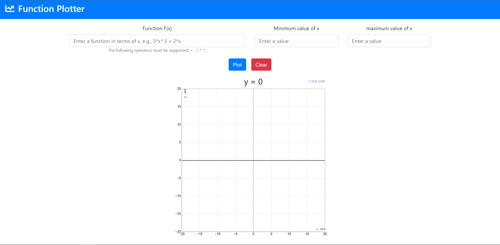
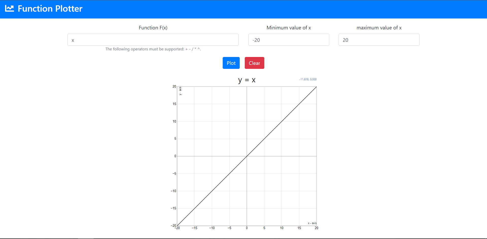
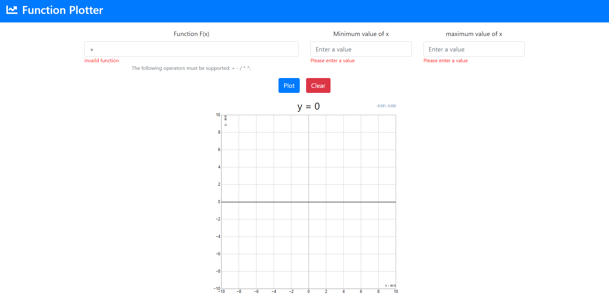

# Function-Plotter
Master Micro's task to test programming skills for summer internship applicants Task1 which a sample web application plot a function F(x).

## 🏁 Get Started <a name = "Install"></a>

```
git clone https://github.com/gaserashraf/Edvora-assessment.git
```
```
npm i
```
```
npm start
```
## 💻 Built Using <a name = "tech"></a>
- **React js**
## 📷 Screenshots

<div name="Screenshots" align="center">
   </a>
   <hr>
   </a>
   <hr>
    </a>
   <hr>
   </a>
</div>
